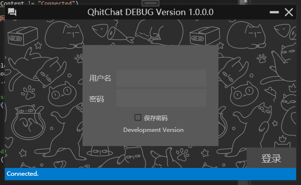
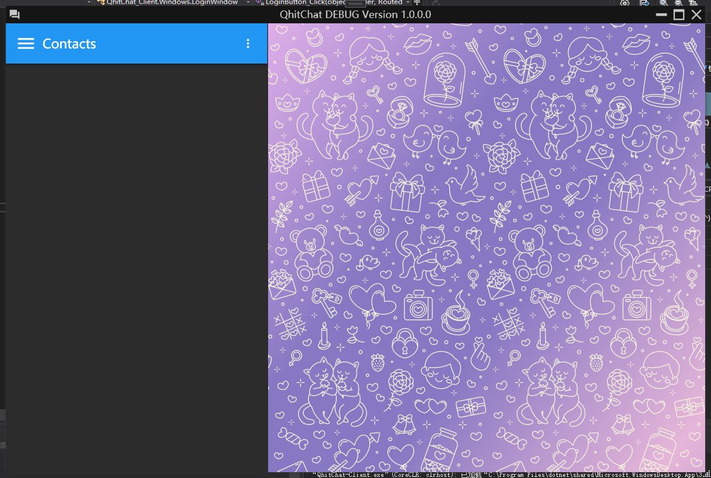

# QhitChat

Yet another prototype instant messaging application written in C#.

## Projects Descriptions
- QhitChat-Server: QhitChat server written in C#
- QhitChat-Client: QhitChat Windows client written in C# powered by WPF.
- QhitChat-prototype: QhitChat Python protocol validation utilities.

## Requirements
### Minimal requirements:
- Visual Studio 2019
- .NET Core 3.1 SDK

### Extended requirements:
- ~~Python 3.7 with Jopyuter.~~ (Deprecated)
- libgdiplus if server running on Linux. (Otherwise change avatar feature is not working properly)

## Screenshots

2021, Team CCTV.